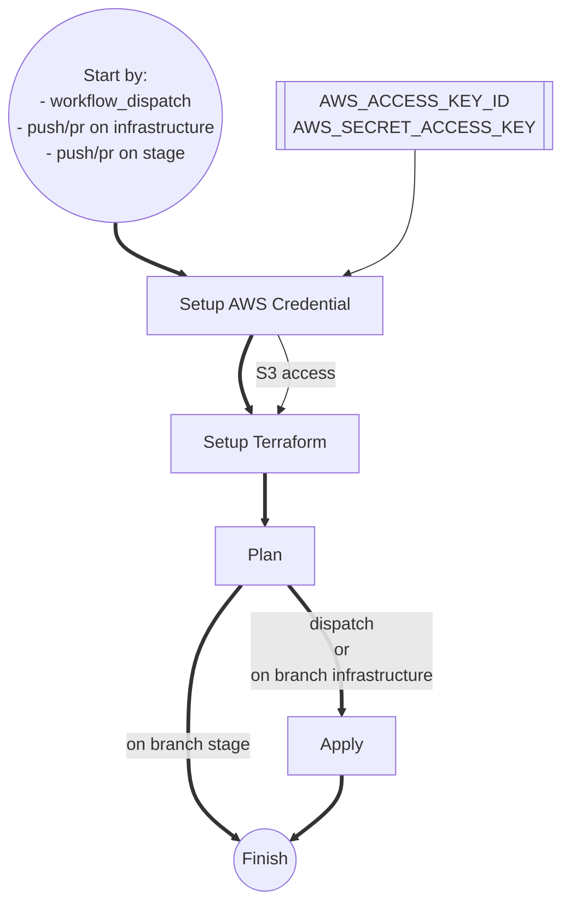
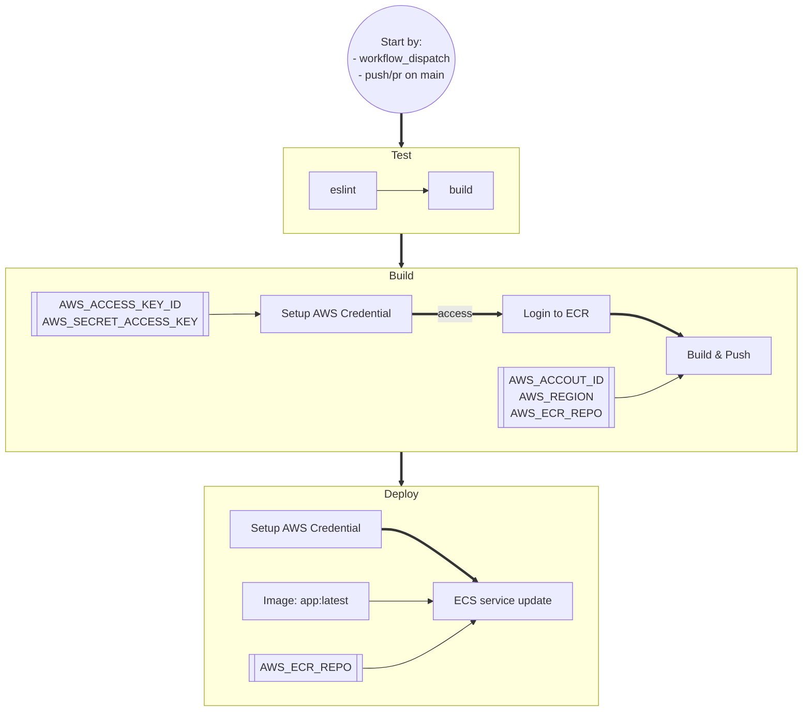

## Getting Started

### NPM

```bash
npm install

# AND

npm run dev
# OR
npm run build && npm run start

```

Open [http://localhost:3000](http://localhost:3000) with your browser to see the result.

### 🐳 Docker

```shell
docker compose build
docker compose up -d
```

Open [http://localhost:80](http://localhost:80) with your browseer to see the result.

## 🧱 Infrastructure

### 🗝️ Secrets for Github Action

AWS related

- `AWS_ACCESS_KEY_ID` (Create an IAM user and generate this)
- `AWS_SECRET_ACCESS_KEY` (Create an IAM user and generate this)
- `AWS_ACCOUNT_ID` (12-bit number)
- `AWS_REGION`
- `AWS_ECR_REPO` (This should be same to the `var.app_name` value you set in `./terraform/variable.tf`)

### Variables for Terraform

1. **Backend**: change the `BUCKET_NAME` and `BUCKET_REGION` to your own
   :warning: The AWS Credential you configured in Github Action Secrets **must** has access to the bucket.
   ```hcl
    backend "s3" {
        bucket  = "BUCKET_NAME"
        key     = "terraform.tfstate"
        region  = "BUCKET-REGION"
        encrypt = false
    }
   ```
2. **App name**: Change the value of the variable 'app-name' in `./terraform/variable.tf`, and keep the `secrets.AWS_ECR_REPO` in Github Action secrets same to that.
   ```hcl
   variable "app_name" {
       type    = string
       default = "my-devops-demo"
   }
   ```

## Workflows

### Terraform



### CI/CD


